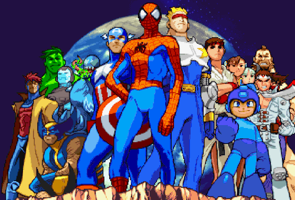

# Hackathon I - Super Heroes Fighters

## subject

> Super Heroes Fighters

## objective

Réaliser un site utilisant l'API de superhéros, et s'éclater.
Exemple:
- Jeu versus (1v1 ou autre)
- Choix des personnages
- Système de Points de vie
- Tour par tour jusqu’au KO
- Résumé de combat

## dates
05/04/18 (14h) -> 06/04/18 (14h) live demo

## guidelines

- groupes libres
- [superheroes API](https://akabab.github.io/superhero-api/api)
- git & github (github pages)
- have fun don't sleep

[[rendus](rendus.md)]
